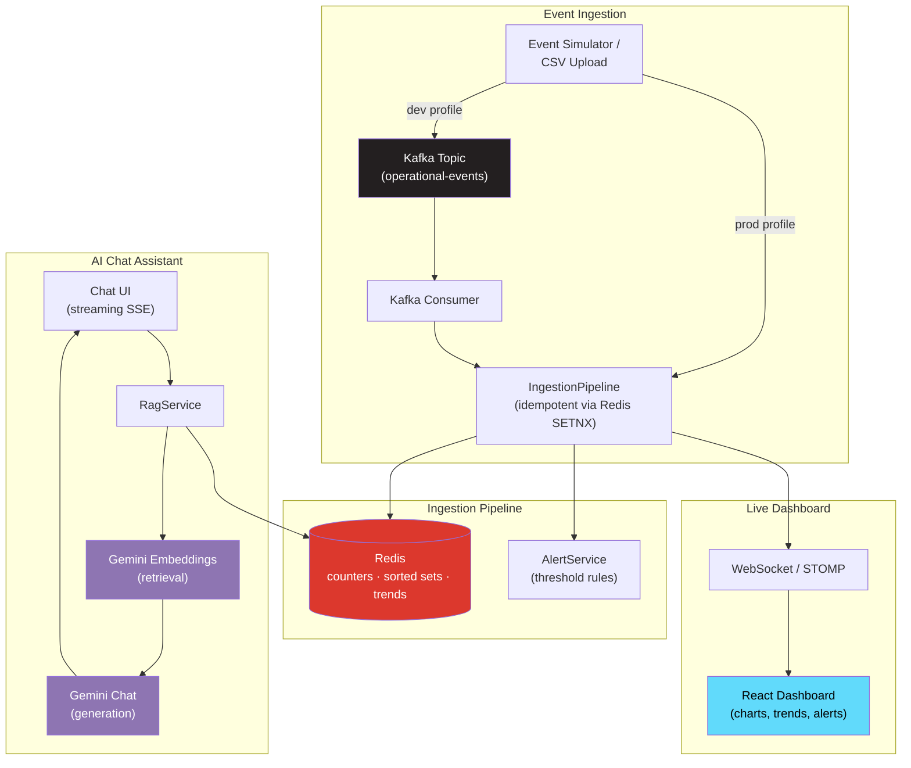

<p align="center">
# Real-Time AI Analytics Assistant

  
  
  
  
  
  
  
  
  
</p>

<p align="center">
  A full-stack, real-time operational analytics dashboard with a Retrieval-Augmented Generation (RAG) chat assistant grounded in live streaming data.
</p>

<p align="center">
  <a href="https://realtime-ai-analytics-six.vercel.app/"><b>Live Demo</b></a> ·
  <a href="https://pujithamalladi.vercel.app/case-studies/realtime-ai-analytics"><b>Case Study</b></a> ·
  <a href="#getting-started"><b>Getting Started</b></a> ·
  <a href="#architecture"><b>Architecture</b></a>
</p>

---

## What this is

Operational events (orders, transactions) stream through **Kafka**, get aggregated in real time in **Redis**, and push live updates to a **React** dashboard over **WebSockets**. A **Gemini-powered RAG chat assistant** sits alongside the dashboard, answering natural-language questions grounded in the live data with streaming responses, retrieval via embeddings, and a real evaluation harness proving it doesn't hallucinate.

This isn't a toy demo with a hardcoded chatbot: the AI assistant only answers using context retrieved from the actual current state of the system, and the whole pipeline is built to survive the realities of a real system, duplicate message delivery, upstream rate limits, malformed input, and concurrent load.

## Architecture



**Two ingestion paths, one pipeline.** Locally (`dev` profile), events flow through a real Kafka producer/consumer pair. In the deployed environment (`prod` profile, no hosted Kafka broker needed), an in-process publisher feeds the exact same `IngestionPipeline`, so the aggregation, alerting, and dashboard logic is identical in both environments; only the transport differs.

## Features

- **Real-time dashboard**, live bar/pie/line charts and an event feed, updated via WebSocket as events stream in
- **AI chat assistant**, ask natural-language questions ("which region is driving the most revenue right now?") and get streamed, grounded answers via Gemini RAG
- **Historical trends**, hourly revenue/event rollups stored in Redis
- **Threshold-based alerting**, automatic detection of success-rate drops or failure spikes
- **CSV ingestion**, bring your own dataset through the same pipeline as live events
- **Idempotent processing**, duplicate event delivery (Kafka rebalances, retries) is deduplicated via Redis `SETNX`, verified with a Testcontainers integration test against real Redis
- **Rate limiting**, per-IP token bucket limiting on the AI endpoints (Bucket4j)
- **Structured logging**, every request tagged with a correlation ID for traceable, greppable logs
- **Graceful degradation**, if the upstream AI provider is rate-limited, the app returns a clean message instead of a 500

## Tech Stack

| Layer | Technology |
|---|---|
| Event streaming | Apache Kafka |
| Cache / aggregation | Redis (Upstash in production) |
| Backend | Spring Boot 3, Java 21, WebFlux (reactive AI client) |
| AI / RAG | Google Gemini (embeddings + streaming chat completion) |
| Frontend | React 18, Vite, Recharts, React Router |
| Testing | JUnit 5, Testcontainers, Mockito |
| Deployment | Render (backend, Docker), Vercel (frontend) |

## Architecture notes / honest tradeoffs

- **Kafka runs locally, not in production.** A real Kafka producer/consumer pair is used in development (`docker-compose`), which is where the actual event-streaming engineering lives. The deployed version swaps in a direct in-process publisher to avoid the cost of a hosted Kafka broker, the downstream pipeline (Redis, alerting, WebSocket, dashboard) is byte-for-byte the same code either way.
- **RAG evaluation uses a controlled, mocked context** rather than the live pipeline, so the "correct" answer is known in advance and the test isolates the model's grounding behavior specifically.
- **Idempotency has a 24-hour window** (Redis key TTL), which is the right tradeoff for a live dashboard, no need to remember an event ID forever, just long enough to survive a consumer rebalance or retry.

## Getting Started

### Prerequisites
- Java 21, Maven, Node.js, Docker Desktop
- A [Google AI Studio](https://aistudio.google.com/apikey) API key (free tier)

### Run locally

```bash
# 1. Start Kafka + Redis
docker compose up -d

# 2. Backend
cd backend
export GEMINI_API_KEY=your_key_here
mvn spring-boot:run

# 3. Frontend (new terminal)
cd frontend
npm install
npm run dev
```

Open `http://localhost:5173`.

### Run tests

```bash
cd backend
mvn test
```

Includes unit tests (alert logic), a Testcontainers integration test (real Redis, proves idempotency), and a RAG evaluation suite (real Gemini calls, gated behind `GEMINI_API_KEY` being set).

## Deployment

- **Backend**: Dockerized Spring Boot app on Render, `prod` Spring profile
- **Frontend**: Vite build on Vercel
- **Cache**: Upstash Redis (serverless, TLS)

See `backend/Dockerfile` and the `prod`/`dev` Spring profiles in `application-*.yml` for the environment-specific configuration.

## License

MIT
